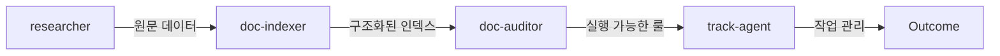

# AI Workflow
> AI 에이전트 파이프라인을 통한 지식 리서치, 구조화 및 트랙 기반 작업 관리 도구

이 프로젝트는 리서치부터 분류, 룰 생성 및 감사, 그리고 체계적인 작업 관리까지 아우르는 AI 에이전트 기반의 범용 워크플로우 엔진입니다. `track-agent`를 중심으로 복잡한 엔지니어링 작업을 안정적인 생명주기 내에서 수행합니다.

## AI 작업 원칙 설정

[AGENTS.example.md](AGENTS.example.md)는 공통 원칙과 환경별 적용 방법을 담은 참고 원본입니다. 새 환경에서는 AI에게 “AGENTS.example.md를 읽고 이 환경의 사용자 전역 지침 파일에 적용해줘”라고 요청하세요. 실제 파일명과 위치는 사용하는 AI에 맞춰 확인하며, 예제 파일 자체가 자동 적용되지는 않습니다.

## 🔄 파이프라인 (Pipeline Flow)



1.  **리서치 (Research):** `researcher`가 방대한 웹 데이터를 수집하고 보존합니다.
2.  **구조화 (Indexing):** `doc-indexer`가 수집된 지식을 카테고리화하고 중앙 인덱스를 생성합니다.
3.  **지침 생성 (Auditing):** `doc-auditor`가 구조화된 데이터를 분석하여 기계적인 코딩 룰과 지침을 도출합니다.
4.  **트랙 관리 (Track Mgmt):** `track-agent`가 생성된 지침에 따라 실제 작업을 7단계 워크플로우에 맞춰 집요하게 수행합니다.

## 🤖 프로젝트 에이전트 (Agents)

| 에이전트 | 핵심 역할 | 제공 스킬 |
| :--- | :--- | :--- |
| **track-agent** | 7단계 TDD 워크플로우 기반 작업 관리 | `tracks-templates` |
| **researcher** | 다각도 웹 검색 및 원문 무손실 수집 | `research` |
| **doc-indexer** | 문서 자동 분류 및 INDEX.md 유지 관리 | `doc-index` |
| **doc-auditor** | 지시 문서 품질 검증 및 룰셋 도출 | `doc-audit` |
| **doc-reconciler** | 문서 간 데이터 충돌 탐지 및 해결 | `doc-reconcile` |

## 🛠️ 전문 스킬 (Core Skills)

*   **`research`**: 자의적 요약 없이 여러 관점의 원문 지식을 보존하며 리서치 수행
*   **`doc-index`**: frontmatter 기반의 문서 카테고리화 및 단일 테이블 인덱스 관리
*   **`doc-audit`**: AI 에이전트용 지시 문서를 기계적 로직으로 교정 및 관제
*   **`readme-craft`**: 프로젝트 유형에 최적화된 고품질 README.md 생성 및 유지
*   **`request-closure`**: 열린 요청을 구현 전에 사용자 승인·검증 가능한 Request Frame으로 수렴

### 요청 닫기 실험

열린 요청을 곧바로 실행하지 않고 사용자가 승인한 Request Frame으로 수렴시키는 첫 실험은 [요청 닫기 사용법과 설계](docs/REQUEST_CLOSURE.md)에서 추적한다. v1은 기존 `track-agent`와 분리된 명시 호출 전용 `request-closure` 스킬이며, Worker·Verifier·ACP·자동 훅은 포함하지 않는다.

## 📂 디렉토리 구조

```text
.gemini/
├── agents/             # 에이전트 페르소나 정의 (.md)
├── skills/             # 에이전트가 호출하는 전문 스킬 모듈
├── tracks-templates/   # track-agent용 워크플로우 템플릿
└── workflows/          # 고수준 작업 파이프라인 정의
docs/
├── REQUEST_CLOSURE.md  # request-closure 사용법과 설계
└── TRACK_AGENT_GUIDE.md # 신규 track-agent 상세 운영 가이드
skills/
└── request-closure/    # 요청 닫기 스킬, 계약, 예제와 validator
```

## 🚀 빠른 시작 (Quick Start)

```bash
# 1. 저장소 클론
git clone https://github.com/insung/ai-workflow.git

# 2. 에이전트 실행 환경 준비 (Gemini CLI 권장)
npm install -g @google/gemini-cli

# 3. track-agent 호출로 작업 시작
gemini run track-agent "프로젝트에 신규 기능을 추가해줘"
```

## 📋 사용 가이드 (Usage)

본 프로젝트의 핵심인 `track-agent`는 단순 명령 수행을 넘어 **브레인 스토밍 → 계획 → 생성 → 구현 → 리뷰 → 테스트 → 최종 확인**의 7단계를 강제합니다. 특히 `리뷰` 단계에서는 에이전트가 사용자에게 날카로운 질문(Grill-me)을 던져 설계의 안정성을 검증합니다.

상세한 운영 방식은 [docs/TRACK_AGENT_GUIDE.md](docs/TRACK_AGENT_GUIDE.md)를 참조하세요.

## 🤝 기여하기 (Contributing)
새로운 에이전트나 스킬을 추가하고 싶다면 `.gemini/` 하위의 구조를 참고하여 풀 리퀘스트를 보내주세요. 모든 지시 문서는 `doc-auditor`의 검증을 거쳐야 합니다.

## 📄 라이선스 (License)
[MIT License](LICENSE)
