# 요청 닫기

`request-closure`는 열린 사용자 요청을 곧바로 실행하지 않고, 사용자가 이해하고 승인한 Request Frame으로 수렴시키는 스킬이다. 이 문서는 첫 설계의 작동 방식과 경계를 설명한다. [현재 스킬과 설치 안내](https://github.com/insung/request-closure)는 독립 저장소에서 관리한다. 첫 버전은 구현·문서 작성·검증 에이전트를 호출하지 않는다. 대상 프로젝트의 기존 파일도 변경하지 않으며, 요청 닫기 산출물만 `.agent-workflow/requests/<request-id>/` 아래에 기록한다.



브라우저에서 설명과 함께 보려면 [HTML 버전](diagrams/request-closure-mechanism.html)을 사용한다. 문서에 삽입하거나 다른 형식으로 변환할 때는 독립적인 [SVG 원본](diagrams/request-closure-mechanism.svg)을 사용한다.

## 설치와 호출

스킬의 정본은 독립 저장소의 `skills/request-closure/`이다. 다음 명령으로 각 도구의 플러그인을 설치할 수 있다.

```bash
codex plugin marketplace add insung/request-closure
codex plugin add request-closure@request-closure
claude plugin marketplace add insung/request-closure
claude plugin install request-closure@request-closure
```

Codex에서는 `$request-closure`, Claude Code 플러그인에서는 `/request-closure:request-closure`로 호출한다. Codex의 스킬 메타데이터는 자동 호출을 막는다. Claude Code에서도 명시 호출 전용으로 유지하려면 `/skills` 메뉴에서 이 플러그인 스킬을 `user-invocable-only`로 설정한다.

대상 프로젝트 루트에서 호출하거나 프롬프트에 대상 경로를 명시한다.

```text
$request-closure
대상 프로젝트의 결제 실패 재시도 정책을 개선하고 싶어.
아직 구현하지 말고 중요한 미결정을 하나씩 확인하여 검증 가능한 Request Frame으로 닫아줘.
```

Claude Code에서는 첫 줄을 `/request-closure:request-closure`로 바꾼다. 새 설치가 목록에 나타나지 않으면 해당 도구에서 새 세션을 시작한다.

예를 들어 요청 ID가 `REQ-20260921-RETRY-POLICY`이면 산출물은 대상 프로젝트 안에 다음과 같이 생긴다.

```text
.agent-workflow/
└── requests/
    └── REQ-20260921-RETRY-POLICY/
        ├── raw-request.md
        ├── frame.json
        ├── decision-ledger.md
        └── read-back.md
```

사용자가 Frame digest를 승인하고 validator가 통과하면 스킬은 멈춘다. 실제 코드나 문서 구현은 승인된 `frame.json`을 입력으로 사용하는 별도 작업에서 시작한다.

## 책임 경계

| 주체 | 책임 | 하지 않는 일 |
| --- | --- | --- |
| Skill | 사실·추론·가정·미결정을 분리하고 다음 중요 질문을 선택 | 사용자의 뜻을 대신 승인 |
| 사용자 | Read-back을 수정하고 최종 Frame을 승인 | 검증 스크립트의 구조 검사를 대신 수행 |
| Validator | 필수 구조, 깊이별 조건, 충돌, 열린 중요 항목, 승인 digest 검사 | 문장의 품질이나 사용자의 진짜 의도를 추측 |

## 상태 흐름

1. **Capture** — 요청 원문을 해석하기 전에 보존한다.
2. **Discover** — 저장소에서 확인한 사실과 에이전트의 추론·가정을 분리한다.
3. **Ask** — 실행 결과를 바꾸는 가장 앞선 중요 미결정 하나를 질문한다.
4. **Read-back** — 현재 이해를 쉬운 말과 필요한 시각화로 사용자에게 되돌려 준다.
5. **Validate** — 결정론적 검사에 실패하거나 사용자가 오해를 발견하면 Frame을 다시 연다.
6. **Approved** — 검사 통과 후 사용자가 승인한 Frame만 닫힌 요청이다.

## 닫기의 깊이

| 깊이 | 적용 조건 | 추가로 닫아야 하는 내용 |
| --- | --- | --- |
| L1 | 영향이 작고 쉽게 되돌릴 수 있음 | 목표, 관찰 가능한 결과, 범위·비범위, 수용 기준, 기본 제약과 권한 |
| L2 | 여러 경로나 소비자에 영향을 주거나 재작업 비용이 큼 | 대안, 영향 경로, 예상 부작용, 되돌림 가능성 |
| L3 | 되돌리기 어렵거나 보안·데이터·비용·배포 위험이 큼 | 명시적 권한, 롤백, 보안·데이터·비용 영향, 독립 검토 필요 여부 |

사용자는 언제든 깊이를 재분류할 수 있다. 질문 횟수는 고정하지 않지만 같은 중요 미결정에서 두 차례 진전이 없으면 `needs-user-direction`으로 멈춘다. 사용자가 답하거나 분류를 바꾸면 같은 요청을 다시 시작할 수 있다.

## 산출물

| 파일 | 역할 | 정본 여부 |
| --- | --- | --- |
| `raw-request.md` | 사용자 원문과 후속 답변의 append-only 증거 | 원문 증거 |
| `frame.json` | 현재 목표, 범위, 수용 기준, 검증 시나리오, 결정, 열린 항목과 승인 상태 | 실행 계약 정본 |
| `decision-ledger.md` | 사실·추론·제안·결정·폐기·대체 이력 | 판단 이력 |
| `read-back.md` | 사용자가 검토하는 쉬운 설명과 필요한 시각화 | 재생성 가능한 투영본 |

`read-back.md`와 `frame.json`이 충돌하면 `frame.json`을 기준으로 Read-back을 다시 만든다. 승인 digest는 `approval`을 제외하고 `status`를 최종값인 `approved`로 정규화한 내용에서 계산한다. 따라서 승인 과정에서 `status`와 `approval`만 바뀌면 digest가 유지되고, 그 외 내용이 바뀌어 digest가 달라지면 승인은 무효이며 다시 질문·확인·승인해야 한다.

## 실제 확인 방법

수용 기준은 “무엇이 성공인가”를 정의하고, verification scenario는 “누가 어디에서 무엇을 확인해 성공을 증명하는가”를 정의한다. 승인된 모든 수용 기준은 하나 이상의 scenario와 연결되어야 한다.

| 확인 가능한 경계 | 기본 검증 예시 |
| --- | --- |
| 사용자 화면이 있음 | 사용자가 UI에서 수행할 절차, 기대 화면, 캡처할 증거 |
| API 또는 CLI가 경계임 | 개발자가 실행할 요청·명령, 기대 응답·종료 코드 |
| 내부 데이터가 결과임 | 확인할 DB 질의, 저장소·파일 변화, 기대 값 |
| 문서가 결과임 | 검토자가 확인할 문서 위치, 의미 기준, 검토 증거 |

UI 결과가 목표인데 DB 행만 확인하는 것은 사용자 수용 검증을 대신하지 못한다. 이 스킬은 검증 방법을 닫고 구조를 검사하는 데서 멈추며, 실제 scenario 실행과 결과 판정은 후속 작업의 책임이다.

## v1 범위 밖

- Worker 또는 Verifier 호출
- 구현·문서 작성 작업의 자동 실행
- ACP, Claude, Codex 등 공급자 연결
- 모든 사용자 요청에 자동 개입하는 훅
- Harness의 dispatch 차단과 런타임 권한 제어
