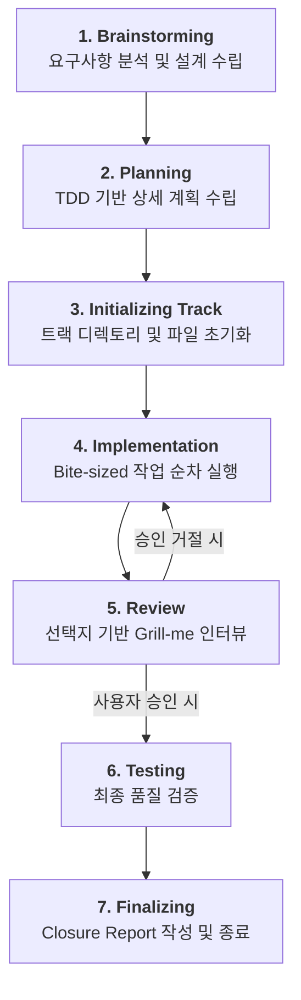

# Track-Agent 운영 프로세스 가이드 (Visual Flow)

본 문서는 `track-agent`가 작업을 처리하는 전체 흐름을 시각화하여 설명합니다. 모든 트랙 관리 파일은 프로젝트 폴더를 오염시키지 않도록 사용자 홈 디렉토리(`~/.track/{project_name}/`)에서 안전하게 관리됩니다.

---

## 🔄 전체 워크플로우 (High-Level)

에이전트는 7단계(Phases)의 생명주기를 거쳐 하나의 작업 단위를 수행합니다.



---

## 🔍 핵심 고도화 기능
### 1. 상태 시각화 (Status Header)
모든 응답 상단에 현재 진행 상황을 직관적으로 표시합니다.
- **규칙**: 현재 진행 중인 단계에만 🚀 이모지 표시

### 2. 유연한 Todo 정책 (Flexible Workflow)
모든 작업에 `todos/` 파일을 강제하지 않고, 작업의 성격에 따라 관리 방식을 최적화합니다.
- **Option A (Flexible)**: 단순 문서 수정이나 설정 변경은 `plan.md`와 `audit.md`에서만 관리합니다.
- **Core Implementation**: 실제 코딩 작업 등 '기술적 상태 보존'이 필요한 경우에만 원자적 단위의 `todos/` 파일을 생성합니다.
- **Why todos/**: 세션 중단이나 에이전트 교체 시에도 '현재 어디까지 구현했는지'를 정확히 복구하기 위한 기술적 체크포인트입니다.

### 3. 핵심 중심의 Todo 구조
`todos/` 파일은 단순한 순서 나열이 아닌, 핵심 성과와 맥락 중심으로 작성합니다.
- **Core Task**: 달성해야 할 구체적인 결과물 정의
- **Context & Dialogue**: 사용자와 협의된 주요 구현 방향 및 힌트 기록
- **Verification**: 작업 완료를 증명할 구체적 방법 명시

### 4. 선택지 기반 Grill-me (Decision Support)
단순한 질문 대신, 구체적인 선택지와 **(권장)** 안을 제시하여 사용자의 의사결정 비용을 최소화합니다.
- **Interrupt Gate**: Grill-me 질문 시 에이전트는 작업을 즉시 중단하고 사용자의 선택을 대기합니다.

### 5. 간소화된 지식 자산화
...
- **status.md**: 전역 경로(`~/.track/{project_name}/YYYY-MM-status.md`)에서 월별 관리
- **DECISIONS.md (ADR)**: 주요 아키텍처 결정을 ADR 형식으로 기록 (Context, Decision, Consequences)
- **LESSONS.md (Index)**: `Lesson-XXX` ID 기반의 경량 오답 노트 (3줄 요약)
- **Audit SSOT**: 트랙 내 미시적 결정은 `audit.md`에만 보존하여 오버헤드 최소화

---

## 📂 글로벌 디렉토리 구조 (`~/.track/{project_name}/`)

```text
~/.track/{project_name}/
├── YYYY-MM-status.md       # 월별 트랙 현황판 (전역 관리)
├── DECISIONS.md            # 주요 아키텍처 결정 기록
...
```
└── 2026-04/
    └── 18_1530_refine-track-templates/
        ├── plan.md            # 마스터 계획
        ├── audit.md           # 의사결정 블랙박스
        ├── closure-report.md  # 종료 리포트
        └── todos/             # 원자적 작업 단위
```
