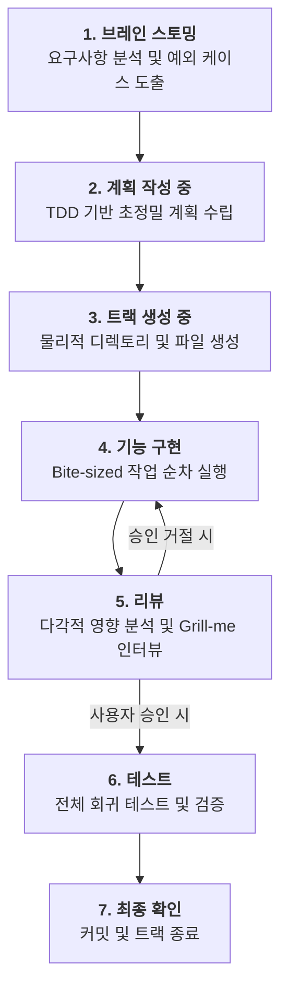

# Track-Agent 운영 프로세스 가이드 (Visual Flow)

본 문서는 `writing-plans`의 상세함과 `grill-me`의 엄격함을 흡수한 신규 `track-agent`가 작업을 처리하는 전체 흐름을 시각화하여 설명합니다.

---

## 🔄 전체 워크플로우 (High-Level)



---

## 🔍 단계별 상세 동작 및 특징

### Phase 1~2: 설계 및 계획 (Planning)
에이전트는 단순히 "무엇을 하겠다"고 말하지 않고, **엔지니어가 바로 코드를 짤 수 있는 수준**으로 계획을 쪼갭니다.

*   **Bite-sized Tasks:** 모든 작업은 2~5분 내외의 TDD 사이클 단위입니다.
*   **No Placeholders:** "적절한 처리" 대신 실제 에러 코드나 로직이 포함됩니다.
*   **TDD Protocol:** 각 Task(`todos/`) 파일에는 반드시 아래 구조가 포함됩니다.
    1. 실패하는 테스트 코드 작성
    2. 테스트 실패 확인 명령어
    3. 최소한의 구현 코드
    4. 테스트 통과 확인 명령어
    5. Git 커밋 명령어

### Phase 4: 기능 구현 (Implementation)
계획된 순서에 따라 작업을 수행하며, 매 응답 상단에는 다음과 같은 **컨텍스트 헤더**가 고정됩니다.
> `> 🎯 목표: [계산기 CLI 구현] | 🔄 상태: 브레인 스토밍 > 계획 작성 중 > 트랙 생성 중 > **기능 구현** > 리뷰 > 테스트 > 최종 확인`

### Phase 5: 리뷰 (Review) - *The Critical Gate*
구현이 끝나면 에이전트가 스스로 질문자가 되어 설계의 빈틈을 찾습니다.

1.  **영향 분석 리포트 제출:**
    *   **의존성:** 이 변경으로 인해 깨질 수 있는 다른 파일 목록
    *   **아키텍처:** `DECISIONS.md`나 기존 패턴 준수 여부
    *   **사이드 이펙트:** 예상되는 부작용 및 위험 요소
2.  **Grill-me 인터뷰:** 리포트 중 가장 위험한 지점에 대해 사용자에게 날카로운 질문을 던집니다.
    *   *"사용자님, 이 함수는 재귀 호출 시 스택 오버플로우 위험이 있는데 그대로 진행할까요?"*
3.  **사용자 승인:** 사용자가 논리적으로 에이전트를 설득하거나 동의해야만 다음 단계로 이동합니다.

---

## 📂 생성되는 파일 구조 예시

트랙이 생성되면 다음과 같은 구조를 갖게 됩니다.

```text
tracks/
└── 2026-04/
    └── 17_1430_new-feature-x/
        ├── plan.md            # 전체 마스터 계획 (TDD 기반)
        ├── audit.md           # 대화 히스토리 및 의사결정 기록
        ├── strategy.md        # 기술적 선택 근거 (선택)
        ├── todos/             # TDD 5단계가 포함된 초정밀 작업 파일들
        │   ├── 1-setup-test.md
        │   ├── 2-impl-logic.md
        │   └── ...
        └── notes/             # 작업 중 발견한 비필수 항목 기록
```

---

## 💡 기대 효과
1.  **문맥 유지:** 세션이 길어져도 상단 헤더를 통해 내가 지금 뭘 하고 있는지 즉시 인지 가능.
2.  **안전성:** `grill-me` 방식의 리뷰를 통해 무분별한 코드 작성을 방지하고 잠재 버그를 사전 차단.
3.  **예측 가능성:** 계획 단계에서 이미 구현 코드가 거의 확정되므로 실행 단계의 불확실성 감소.
