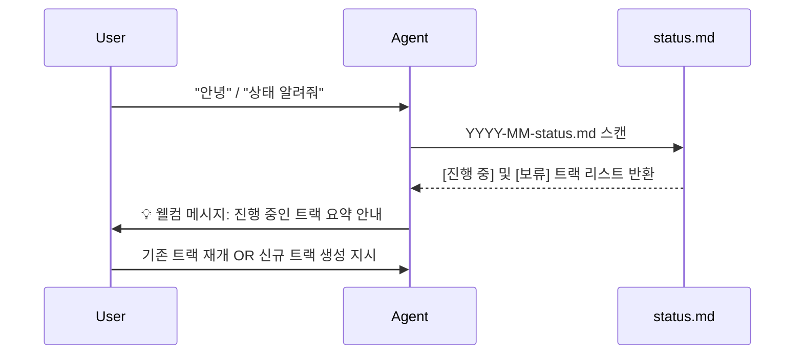
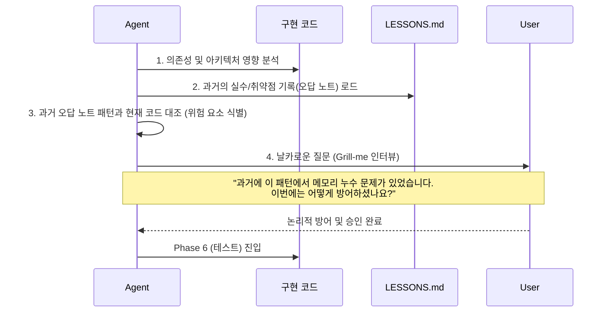
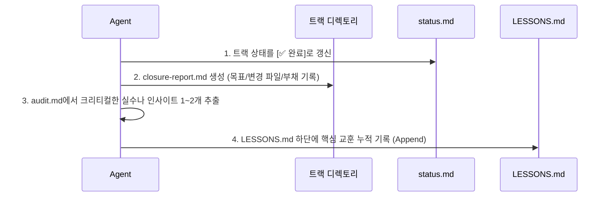
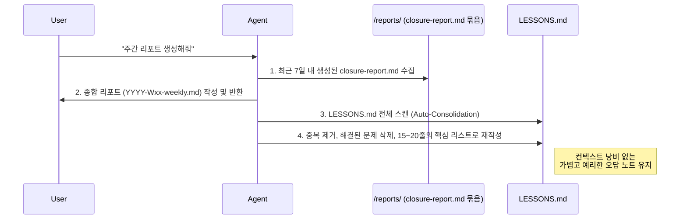

# Track-Agent 운영 프로세스 가이드 (Visual Flow)

본 문서는 `writing-plans` 스킬의 정밀함과 과거 오답노트(`LESSONS.md`) 기반의 엄격한 리뷰 문화를 갖춘 신규 `track-agent`가 작업을 처리하는 전체 흐름을 시각화하여 설명합니다. 모든 트랙 관리 파일은 프로젝트 폴더를 오염시키지 않도록 사용자 홈 디렉토리(`~/.track/{project_name}/`)에서 안전하게 관리됩니다.

---

## 🔄 전체 워크플로우 (High-Level)

에이전트는 7단계(Phases)의 생명주기를 거쳐 하나의 작업 단위를 완벽히 수행합니다.

```mermaid
graph TD
    A[<b>1. 브레인 스토밍</b><br/>요구사항 분석 및 예외 케이스 도출] --> B[<b>2. 계획 작성 중</b><br/>TDD 기반 초정밀 계획 수립]
    B --> C[<b>3. 트랙 생성 중</b><br/>물리적 디렉토리 및 파일 생성]
    C --> D[<b>4. 기능 구현</b><br/>Bite-sized 작업 순차 실행]
    D --> E[<b>5. 리뷰</b><br/>LESSONS.md 기반 과거 오답 참조 및 Grill-me 인터뷰]
    E -- 승인 거절 시 --> D
    E -- 사용자 승인 시 --> F[<b>6. 테스트</b><br/>전체 회귀 테스트 및 검증]
    F --> G[<b>7. 최종 확인</b><br/>closure-report 생성 및 교훈(Lessons) 기록 후 종료]
```

---

## 🔍 상세 워크플로우 (Detailed Flows)

신규 기능(리마인더, 과거 오답 기반 리뷰, 체계적인 트랙 종료 및 주간 리포트)이 반영된 상세 내부 동작 흐름입니다.

### 1. 에이전트 시작 및 웰컴 메시지 (Startup Flow)
사용자가 뚜렷한 작업 지시 없이 에이전트를 호출했을 때 작동합니다.



### 2. 리뷰 단계 고도화 (Phase 5: Review Flow)
단순한 코드 리뷰를 넘어, 프로젝트 전체에 누적된 과거의 실수(오답 노트)를 참조하여 똑같은 실수를 반복하지 않도록 방어합니다.



### 3. 트랙 최종 종료 (Phase 7: Closure Flow)
트랙을 종료할 때, 단순 상태 변경이 아닌 구체적인 `closure-report.md` 문서를 남기고 다음 트랙을 위한 교훈을 추출합니다.



### 4. 주간 리포트 및 오답 노트 압축 (Weekly Report & Auto-Consolidation)
단일 파일(`LESSONS.md`)이 무한정 길어져 컨텍스트를 낭비하는 것을 막기 위해, 주간 리포트 작성 시 함께 최적화를 진행합니다.



---

## 📂 글로벌 디렉토리 구조 예시 (`~/.track/{project_name}/`)

모든 관리는 프로젝트 내부가 아닌, 안전하게 격리된 사용자 홈 디렉토리 글로벌 공간에서 이뤄집니다.

```text
~/.track/{project_name}/
├── YYYY-MM-status.md       # 트랙 상태 현황판 (웰컴 메시지 소스)
├── DECISIONS.md            # 전역 아키텍처 결정 인덱스
├── LESSONS.md              # 단일 오답 노트 (리뷰 시 1순위 참조, 주간 리포트 시 압축)
├── reports/
│   └── 2026-W16-weekly.md  # 주간 리포트
├── plans/                  # writing-plans 스킬이 생성한 상세 구현 계획 모음
├── specs/                  # brainstorming 스킬이 생성한 설계 문서 모음
└── 2026-04/
    └── 17_1430_new-feature-x/  # 개별 작업 트랙 디렉토리
        ├── plan.md            # 전체 마스터 계획 (TDD 기반)
        ├── audit.md           # 대화 히스토리 및 의사결정 기록
        ├── closure-report.md  # 트랙 종료 시 작성되는 요약 보고서 (Phase 7)
        ├── todos/             # TDD 5단계가 포함된 초정밀 작업 파일들
        └── notes/             # 작업 중 발견한 비필수 항목 기록
```