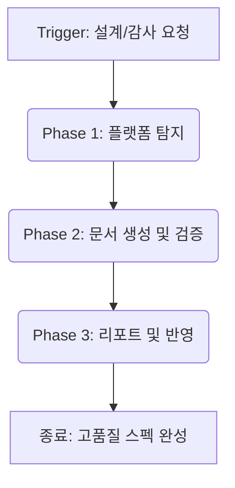
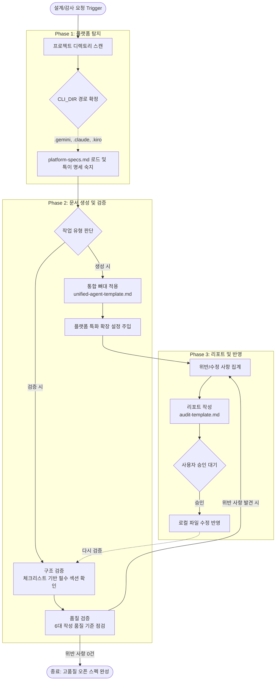

# Validate Agent Spec (Open Standard) Workflow

본 문서는 `validate-agent-spec` 스킬(이전 명칭: `doc-audit`)의 내부 동작 원리와 검증 워크플로우를 상세히 정의합니다. 이 스킬은 특정 AI CLI(Gemini, Claude, Kiro 등)에 종속되지 않는 **'오픈 스탠더드(Open Standard)'** 에이전트 명세를 강제하고 통합하기 위해 설계되었습니다.

---

## 1. 전체적인 흐름 (High-Level Workflow)

`validate-agent-spec` 스킬은 사용자가 에이전트/스킬 문서의 설계, 감사, 또는 규칙 생성을 요청할 때 트리거되며, 크게 3단계로 동작합니다.

---

## 2. 상세한 흐름 (Detailed Workflow)

아래는 플랫폼 탐지부터 검증, 리포트, 재검증 루프까지 이어지는 전체 프로세스의 상세 시각화 다이어그램입니다.

### Phase 1: 플랫폼 탐지 (Platform Detection)
AI 에이전트가 실행되는 환경의 맥락을 파악하고, 참조할 디렉토리 변수를 확정하는 단계입니다.

1. **디렉토리 스캔**: 프로젝트 루트에 존재하는 설정 디렉토리를 스캔합니다. (`.gemini`, `.claude`, `.kiro` 등)
2. **`{CLI_DIR}` 확정**: 탐지된 플랫폼 디렉토리를 기준으로 `{CLI_DIR}` 변수를 정의하여, 이후 생성되는 문서의 참조 경로를 동적으로 구성합니다.
3. **플랫폼 명세(`platform-specs.md`) 로드**: Kiro의 `agent.json` 레지스트리, Claude의 `Hooks` 및 `Effort` 제어, Gemini의 `Policy Engine` 등 각 플랫폼이 요구하는 고유한 설정 체계를 숙지합니다.

### Phase 2: 문서 생성 및 검증 (Architecting & Auditing)
문서의 종류(에이전트, 스킬, 룰)를 판별하고, 해당 종류에 맞는 뼈대를 생성하거나 기존 내용을 엄격하게 검증합니다.

#### A. 생성 시 (Architecting)
1. **유형 판별**: 작성해야 할 문서가 페르소나(Agent)인지, 절차서(Skill)인지 판단.
2. **뼈대 적용**: `resources/unified-agent-template.md` (오픈 스탠더드 통합 템플릿)를 기본 뼈대로 사용합니다.
3. **확장 설정 주입**: Phase 1에서 파악한 플랫폼 정보를 바탕으로 프론트매터(Frontmatter)에 벤더 특화 설정(`kind`, `isolation`, `effort` 등)을 추가합니다.

#### B. 검증 시 (Auditing)
1. **구조 검증 (Structural Check)**:
   - 대상 파일이 해당 유형의 체크리스트(`structure-agent.md`, `structure-skill.md` 등)에 명시된 필수 섹션을 모두 갖추고 있는지 확인합니다.
   - 예: 에이전트 문서에 `YAML Frontmatter`, `Identity`, `Operational Directives`, `Constraints`가 있는지 점검.
2. **품질 검증 (Quality Check)**: 6대 품질 기준(`audit-checklist.md`)을 적용합니다.
   - **단호한 명령문**: 모호한 서술형(~하는 것이 좋다) 배제.
   - **부정적 제약**: `[DANGER]` 또는 `🛑` 태그가 붙은 금지 조항 포함 여부.
   - **명시적 조건문**: "If A, then B" 형태의 논리 구조 확인.
   - **Output 템플릿**: 결과물의 포맷 지정 여부.
   - **참조 구조**: 타 문서 참조 시 정확한 상대 경로(`{CLI_DIR}/...`) 명시 여부.
   - **간결성**: 유형별 라인 한도 초과 시 분리 구조(`resources/` 하위로 이동) 적용 여부.

### Phase 3: 리포트 및 반영 (Report & Apply)
검증 결과(위반 사항)를 정리하고, 실제 파일에 수정 사항을 반영하는 마무리 단계입니다.

1. **위반 사항 집계**: 구조 및 품질 검증에서 발견된 문제점과 위반 라인을 수집합니다.
2. **리포트 작성**: `resources/audit-template.md` 포맷에 맞춰 [PASS | WARN | FAIL] 심각도 판정과 함께 구체적인 수정 Diff를 제시합니다.
3. **승인 대기 (중요)**: 로컬 파일을 임의로 덮어쓰지 않고, 사용자의 승인(`[승인 요청]`)을 대기합니다.
4. **반영 및 재검증**: 사용자가 승인하면 파일을 수정(`write_file` 또는 `replace`)하고, 위반 사항이 0건이 될 때까지 다시 2단계부터 재검증을 수행합니다.

---

## 3. 핵심 이점 (Benefits)

- **벤더 락인 방지 (Vendor Lock-in Free)**: 특정한 AI CLI 플랫폼에 종속되지 않는 범용 마크다운 스펙을 유지합니다.
- **예측 가능성**: 에이전트가 어떤 환경에 배포되든 동일한 필수 구조를 가지므로 예측 가능한 성능을 냅니다.
- **안전성**: `Constraints` 섹션을 강제하여 에이전트의 환각이나 위험 행동을 원천적으로 차단합니다.
